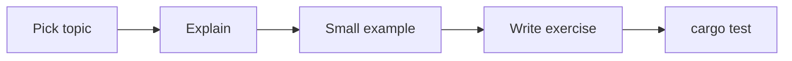

# Start Lesson

Begin the next Rust lesson with SuperGrok.

## Usage

```
@start-lesson [topic]
```

If no topic is given, pick the next unfinished lesson under `lessons/`.

## CRITICAL: Teach, Then Exercise

The agent MUST:

1. State the one concept this lesson covers
2. Give a 10-20 line example
3. Show a common compiler error for this concept
4. Add or update a `lessons/<topic>/` crate
5. Leave at least one test that the learner can make pass

The agent MUST NOT:

- Cover more than one major concept
- Generate a full textbook chapter
- Implement production crate features (Rust Engineer)

## Workflow



## Suggested Sequence

1. Hello Cargo
2. Ownership and moves
3. Borrowing and references
4. Structs and enums
5. `Option` and `Result`
6. Traits
7. Lifetimes
8. Modules and crates
9. Iterators
10. Testing and clippy

## Hand-off

When the lesson crate compiles, stop and tell the learner which test to run.
