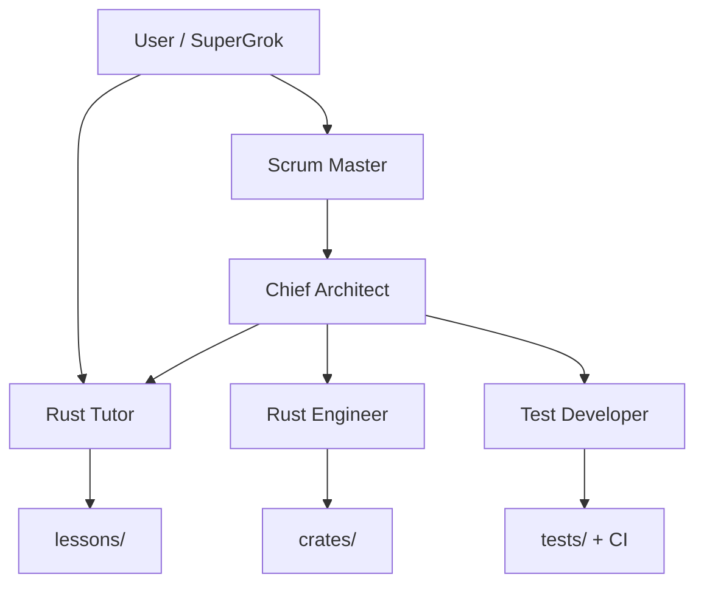

# Agent Tools Reference

How Cursor IBKR TWS Lab Cursor agents work together.

## When to use which agent

| Need | Agent |
|------|-------|
| Learn a concept | Rust Tutor |
| Write crate API | Rust Engineer |
| Add tests / CI | Test Developer |
| Sequence work | Scrum Master |
| Approve design | Chief Architect |

## Commands

| Command | Purpose |
|---------|---------|
| `@start-lesson` | Open the next lesson crate |
| `@explain-concept` | Teach one idea |
| `@review-rust` | Idiomatic review of the diff |
| `@run-ticket-plan` | Show the next ticket, do not implement |
| `@configure-github-issue-script` | Wire issue creation to a sprint plan |

## Ticket prefixes

`LESSON`, `RUST`, `FEAT`, `TEST`, `DOC`
